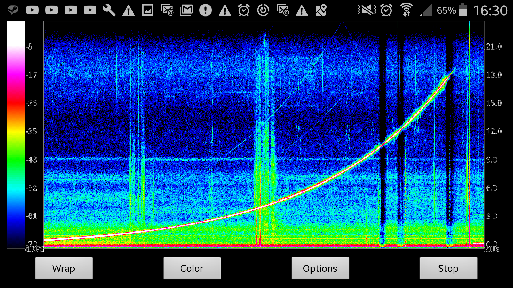
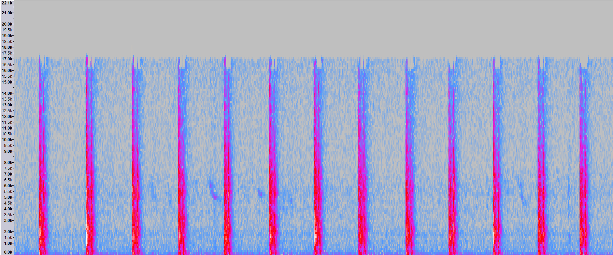
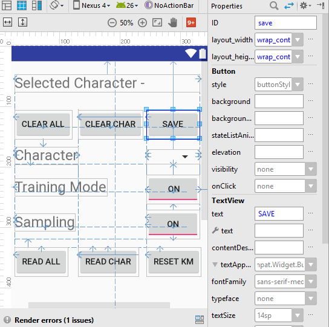
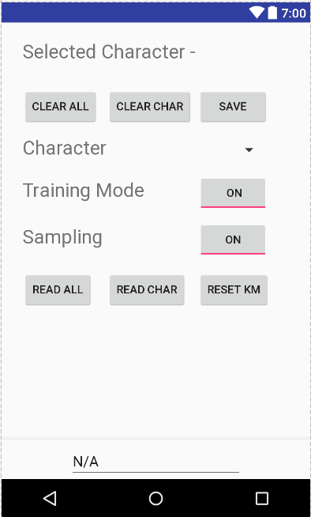

<div style="position:fixed; top:0; left:0; margin:10px;">
<a href="#contents">Back to Contents</a>
</div>

# Acoustic Keylogging via Smartphone devices - Corpus

<a name="contents"></a>

## Contents

1. **[Introduction](#introduction)**

   * [Author & date](#author)
   * [Abstract and Aim](#abstract)
     * [Abstract](#abstract_abs)
     * [Aim](#abstract_aim)
   * [Special Thanks](#thanks)

2. **[Meetings](#meetings)**

   * [Purpose](#purpose)
     * [Audio files](#audio)
     * [Meeting summaries](#meeting_sum)


3. **[Previous Research](#research)**

   * [Accelerometer Side Channel Attacks](#asca)
   * [Cracking Passwords using keyboard acoustics and language modelling](#crackingpass)
   * [Keyboard Acoustic Emanations](#kae)
   * [Keyboard Acoustic Emanations Revisited](#kaer)
4. **[Hardware](#hardware)**

   * [Smartphone Technology](#smartphone_tech)
     * [Microphone](#tech_mic)
   * [The Android Operating System](#android_os)
     * [Android 'Java'](#android_java)
   * [Keyboard Hardware](#keyboard_tech)
5. [**Testing conditions**](#testing_con)

   * [Constraints](#constraints_keyboard)
     * [Keyboard ](#constraints_keyboard)
       * [Location](#constraints_keyboard_location)
       * [Membrane vs Mechanical ](#constraints_keyboard_mech)
     * [Smartphone ](#constraints_phone)
       * [Operating System ](#constraints_phone_os)
       * [Microphone](#constraints_phone_mic)
     * [Lab conditions](#constraints_lab)
   * [Variables](#variables)
     * [Background noise](#var_bn)
     * [Phone model](#var_pm)
     * [Location of phone](#var_location)
     * [Keyboard](#var_key)
     * [Impact strength & location](#var_impact)
6. [**Testing methodology**](#testing_meth)

   * [Initial testing plans](#testing_init)
   * [Testing process](#testing_proc)
     * [Small subset](#testing_small)
     * [Larger subset](#testing_large)
7. [**Feature extraction**](#feature_extract)

   * [Features](#extract_feat)
     * [Amplitude](#extract_amp)
     * [Frequency](#extract_freq)
   * [Pre-recorded audio extraction](#extract_prae)
   * [Live audio extraction](#extract_lae) 
   * [Isolating peaks](#extract_ip)
     * [Subsampling](#extract_sample)
8. [**Feature Analysis**](#feature_analysis)

   * [Simple comparison](#feature_simple)
   * [Supervised and unsupervised learning](#feature_su)
     * [Mean approximation](#feature_ma) 
     * [Kmeans clustering](#feature_kmeans)
9. [**Development process**](#dev)

   * [Development process ideology](#dev_pro)
     * [Iterative design](#dev_id)
     * [Version control](#dev_vc)
     * [IDE (Integrated Development Environment)](#dev_ide)
   * [Program Steps](#dev_ps)
     * [Initial Setup](#dev_is)
       * [Launch](#dev_lau)
       * [GUI building](#dev_guib)
       * [Dataset loading](#dev_dl)
       * [Thread establishment](#dev_te)
     * [Feature Extraction](#dev_fe)
     * [Feature Analysis](#dev_fa)
     * [Supervised/Unsupervised Learning](#dev_sul)
       * [Mean approximation](#dev_ma)
       * [Kmeans clustering](#dev_kc)
     * [Storing results](#dev_sr)
   * [Android API](#dev_aa)
     * [API Permissions](#dev_ap)
     * [AudioRecord](#dev_ar)
     * [XML Design Layouts](#dev_xdl)
   * [GUI functionality](#dev_guif)
     * [Buttons](#dev_b)
     * [Visualising](#dev_gui_vis)
10. [**Results**](#results)

  * [Initial results](#results_init)
  * [Using sophisticated feature extraction](#results_fe)
  * [Mean approximation](#results_ma)
  * [Kmeans clustering](#results_kc)
11. [**Conclusion**](#conclusion)

---

<a name="Introduction"></a>

## 1. Introduction

<a name="author"></a>

###1.1 Author & Date

This project was started in January of 2017 and finished in August of 2017, with the current dated version of this corpus being 21/8/2017.

The author of this corpus is Daniel Jack Andrews, if you have any queries you can contact the author at [dja33@kent.ac.uk](mailto:dja33@kent.ac.uk).

<a name="abstract"></a>

### 1.2 Abstract & Aim

<a name="abstract_abs"></a>

#### 1.2.1 Abstract

Nearly every user on the market owns a smartphone within the western first world. These modern day smartphones often contain technology that is more powerful and sophisticated that the rockets that delivered man to the moon.

Considering this the potential power behind the average smartphone is huge, even for the purpose of breaking security measures. Computer keyboards are not a new invention and have been rooted to the development of computers since their creation; however they are fundamentally at the hand of every and all sensitive data entry. Sensitive data could reflect bank details, passwords, personal or confidential information and more. 

The dissertation that this corpus supports aims to challenge whether a modern day smartphone can acoustically eavesdrop on a keyboard through side-channels in the acoustic noise produced by pressing the keys on the board.

<a name="abstract_aim"></a>

#### 1.2.2 Aim

This corpus aims to provide and support the dissertation associated with it such that any reference of relation to the material, results or development of the dissertations logic, applicants or findings can be backed up and catalogued. This corpus will skim over certain aspects of the project, where instead these details can be found in the bulk of the dissertation. Instead this corpus aims to provide a uniformed catalogue of data used as referencing points in the dissertation thesis itself.

<a name="thanks"></a>

### 1.3 Special Thanks

This project could not have been completed without the following people and groups who have provided wonderful guidance and support throughout the project.

* Budi Arief - Supervisor, computer security lecturer.
  * Met with me regularly to conduct guidance meetings and help keep me on track of the topic at hand, always firm and willing to provide assistance when needed.
  * Founded the project concept and passed it onto me.
* Samuel Williams - PhD candidate, programming language implementation specialist.
  * Provided fantastic knowledge on artificial intelligence and had a deep appreciation for the research topic covered in this material.
* Alice Mo - Data Mining Analyst and MSc candidate at University College London
  * Fundamentally showed and helped deal with resolving data and identifying useful traits in it.
* Michael Berry - PhD, software engineer, electronics tinkerer and radio licence holder.
  * Provided assistance on digital signal processing, explaining Fourier transforms and utilising feature extraction.
* The Shed - Group of knowledgeable technicians with a wealth background experience in varying fields.
  * Helped laser cutting a frame and suggesting potential fixes to issues.

---

<a name="meetings"></a>

## 2. Meetings

<a name="purpose"></a>

### 2.1 Purpose

On several occasions I met my supervisor Budi Arief to discuss the project undertaken. These meetings were intended to provide insight into the current status of the project while assisting in any issues and providing other forms of support to the project.

<a name="audio"></a>

### 2.2 Audio recordings

Unfortunately I have only three audio recorded sessions as my audio recording equipment failed on two occasions. Below are the three recorded meetings I do have access to. For all other meetings I took detailed notes on our discussions.

* 15/5/2017 (In person) - [View](meetings_audio/15.05.m4a)
* 21/7/2017 (In person) - [View](meetings_audio/21.07.m4a)
* 14/8/2017 (On Skype) - [View](https://youtu.be/ac2mPSi0TXU)

In-between June and August I lost two of my recordings. 

<a name="meeting_sum"></a>

### 2.3 Meeting summaries

##### 31/1/2017 - Initial Preparation

Discussed hardware capabilities, such as whether the phone being used has multiple microphones, where they are and what sort of sensors to utilise.

Discussed controlled environment settings:

- Specific keyboard to use, in this case mechanical keyboard model "Razer BlackWidow 2014 Ultimate" - using Razers patterned mechanical keys.
- Specific to Android OS only for the purpose of the research
- 20 presses of specific keys, 'Q', 'W', etc.
- Lasercut potential frame to hold keyboard and phone, ensure that the distance between them is always fixed and therefore stops variations in this.
- Decided to use my Android phone to do this project under.
- Keys such as space will be hard to identify due to their size and potential to be struck in varying places.

Other items to note:

- Research into Side-Channel attacks, use Google scholar or the similar academic search engine.
- Pattern databases.
- Look into Accelerometer feature set and how it interacts with the Android OS.
- Record the results of whatever happens.

##### 17/2/2017 - Measuring Raw Data

- Produced a small demo Application for Android that will report sensory data from the phone, discussed which keys to focus on and just recording the values for the time being before trying to identify any particular pattern.
- Use keys that are of varying sizes and distances away from one another to help for identification, keys mention included:
  - Q
  - ENTER
  - O
  - LEFT-CONTROL
  - SPACE
- Investigate potentially new technologies
- Research into feature extraction to further develop an understanding of the topic material
  - For sound:
    - Amplitude
    - Frequency (Fast Fourier Transform, algorithm adapted from discrete fourier transform)
  - For accelerometer:
    - X, Y, Z forces
    - Speed
    - Also capable of performing FFT on these as well
  - Alternatively, potential for Gyroscopic sensor too.

##### 28/2/2017 - Initial Attempt at Isolating Raw Data

Initially this was a demoralising iteration, I found that the accelerometer was slow within the Android SDK and that I would not reliable be able to identify or determine key presses given such little ranging values over a sample, such that I decided for the time being to focus solely on acoustic keylogging rather other features. 

Decided to go back to the 'drawing' board and look at research more thoroughly, other assessments had gotten in my way and little work had been made through this iteration.

Had difficulties isolating the memory storage on the Smartphone as it appeared under a 'virtual' filesystem such that I couldn't accurately locate the file that I was saving all my samples and readings to.

Found that amplitude wasn't a good measurement for feature extraction alone and that frequency would be an absolute requirement.

Had laser cut a frame however to hold the phone and keyboard in place.

##### March, April, May

A lot of this time was spent working on assessments, exams and job interviews. Evaluation of research was the focus in this period while the development occurred post June. As such I shall present the researched papers and a link to my evaluations of those. These papers provided the foundation of the majority of my work, with research from Andrew Kelly featuring prominently.

* Cracking Passwords using keyboard Acoustics and Language Modeling - Andrew Kelly (2010)
* Keyboard Acoustic Emanations - Asonov and Agrawal (2004)
* Keyboard Acoustic Emanations Revisited - Zhang, Feng, Tygar (2009)

##### 15/06/2017 - Pre deliverable submission

[Audio](meetings_audio/15.05.m4a)

We discussed what had been completed so far for the project, I had scrapped my previous codebase as I wasn't happy with the quality of it. As such the focus at this part was that the research had been fully conducted in the project. 

We focused on three main elements of the project after research:

* Experimentation and methodology
  * Consistent testing
  * A lab condition
  * Training data sets on keypresses
* Implementing a proof of concept
  * On the Android operating system
  * Focussing on live-recorded audio
  * Some form of machine learning involved
* Other ideas for later use
  * Dictionary based attack to decipher potentially misspelled English words
  * Potential to then get the context behind a message, the emotion and power play of the words
  * Biometric profile of the individual

##### 6/07/2017 - Implementation progress update

Unfortunately I lost the recording for this meeting but I did however make some notes on the topics mentioned. The focus of the meeting was applying a Fourier transform across a discrete dataset of values for analysis in the frequency domain. Such that we could later pass this into a feature extraction function that would return us distinct features of keystrokes.

##### 12/07/2017 - Implementation progress update

Another lost audio recording for this meeting.

I had successfully written a feature extraction algorithm that was able to identify distinct differences in frequency and magnitude between two key presses, albeit there were complications with live audio recording as to be expected.

The next focus on was on refining this feature extraction if possible and looking into a primitive machine learning algorithm to help classify and train the keys being pressed. In this case the focus being on a supervised algorithm.

##### 21/7/2017 - Testing methodologies 

[Audio](meetings_audio/21.07.m4a)

A setback  occurred where my AudioRecord API ceased to operate and instead started spurring errors, after fixing these owing to updated Android API permission system the project was back on track.

Discussed the possibility of focussing on multiple keyboards but for the time being decided to look at just one keyboard until later period. Talked about storing the data and dealing with Androids file system in a manner that can be adjusted accordingly if need be. Java offers serialisation, a useful mechanism of preserving the data encapsulated within an object at runtime; potential for this tool to be used. Preserving data comes in the form of being able to then use this as a measurement of comparison for later, i.e I'm able to identify the key C because I have told my program from training that key C sounds like this.

Decided that the phone should handle everything, previously there was a thought of potentially having a machine elsewhere decode the live audio into information but instead the confirmation of the phone being the sole processing machine was decided. Rationality for this was user ability, if anyone owns a phone then they also can do what this project aims for.

Discussed potentially having a visual display of characters being decoded as an end goal, however for this to be effective it would require that the device was able to quickly identify as many keys as possible as well as having a high degree of accuracy in doing so.

Talked briefly about Mel-cepstrum Frequency Analysis, a technique often used in voice recognition systems although this methodology was too foreign to be adopted. 

Finished up with discussing the corpus and dissertation display and layout, decided to use markdown and provide the corpus in a HTML relative structure.

##### 14/8/2017 (On Skype) - Evaluation of Android Application 

[Audio](https://youtu.be/ac2mPSi0TXU) - Provided on YouTube, otherwise it's 1.4GB.

**Note** - The previous 3 weeks consisted of back and forth between me and Budi, trying to arrange a meeting as both of us were unavailable at several periods. 

This meeting was a final conclusive meeting of the project coming to an end. I spent time explaining the working system for the keylogger as well as providing details on several anecdotes regarding the system. Details included:

* Feature extraction
* Mean average supervised learning
* Kmeans unsupervised learning
* Saving results
* Identifying keystrokes based on results

The he results of kmeans clustering were more accurate than mean average, kmeans scored around ~60% while mean average scored around ~52%. At this point the focus was on writing the corpus and working towards the dissertation. 

**Note** - A final meeting is planned for the 29/8/2017 but since the Corpus will have been submitted it will not be documented, this meeting aims to provide details and feedback on the state of the dissertation.

---

<a name="research"></a>

## 3. Research

<a name="asca"></a>

### 3.1 Accelerometer Side Channel Attacks

[Paper](research/AccelerometerSideChannel.pdf)

Using the accelerometer on Android based smartphones to determine a users phone pin/pattern unlocking code. Research in this field shows that success rates in controlled environments are high (such as the user sitting down being motionless) whereas in uncontrolled environments rates dropped but still maintained a concerning high level of accuracy.

They provided relevant research from others in the field in similar veins of collecting data, previous papers referenced in this include:

- [TouchLogger](research/TouchLogger.pdf): Inferring Keystrokes On Touch Screen From Smartphone Motion
- [TapPrints](research/TapPrints.pdf): Your Finger Taps Have Fingerprints - focuses on a similar vein of research as the source but utilises gyroscopic and accelerometer data to infer key presses.

The paper makes reference to different MAXIMUM sample rates of certain phones and through my own research I've found a piece of [software](https://github.com/dantasse/AccelerometerTest/) capable of measuring the speed of a phones accelerometer which will be useful later in my own research.

They used multiple phones to correlate their findings with varying refresh rates. Collected 5 samples of each pin/pattern entry but before this had each tester enter 50 random pins/patterns with their dominant hand then following this doing the same but walking around.

- The controlled data (Sitting) was used for training.
- The variable data (Walking) was used for testing.
- Utilising multiple mathematical formula to try to classify the data in a meaningful manner.
  - Mean Normalisation, Linear Normalisation, Quadratic Normalisation
  - iFFT-Poly, iFFT-Acc and 3D-Polynominal graphing

Utilising these formula they found a large **variance** between values, even when entering the same pin and such that they needed to **normalise** the raw signal. They used a 1-dimensional Discrete Fourier Transform with a resolution of 35 samples and found that the larger sample set would add to much variance while a smaller sample set would not preserve enough information.

The paper talks in detail about using Hidden Markov Models to predict unknown pins due to the limitations of having a classifier that only knows the patterns given by users.

They then suggest potential solutions to the problem presented:

- Vet programs that use sensors, try to identify any malicious behaviour or intent. Scale is too hard for this.
- Restrict sampling rate, but as the paper demonstrates even at 20KHz still possible to monitor fairly accurately.
- Utilise a permission model warning users about the permissions given to an app, mostly ignored by the user anyway.

Their suggested solution is:

- Disable the sensors whenever a trust related action is being performed, such as entering a password. Current security models do not allow for this, but future proofing may be required.

**Conclusion**

Conclusively the paper ends by explaining that a side-channel attack is possible and potentially dangerous even with noise introduced, drawing parallels between itself and other papers in the field it makes use to explain how one could expand upon the research. 

However this research focuses on inferring data from then touchscreen and does not guarantee that the same can be used for keystrokes on a physical keyboard. (As it later turns out, this is the true that Android is too limited to be able to deduce another features alone from vibrations for keystroke analysis)

<a name="kae"></a>

###3.2 Keyboard Acoustic Emanations 

[Paper](research/KeyboardAcousticEmanations.pdf)

Written in 2004 the original paper addresses the ability to identify with a high degree of accuracy keystrokes from emanations created from sound via side-channel attacks. Asonov and Agrawal provide a detailed understanding of the attack, how it works, why it works and methods to potentially disable or weaken the attack.

The paper expands by explaining that they recorded 2-3ms worth of the ’touch-peak’ in which they are able to extract reliable features from the sample given. That initially they tested keys ’l’ and ’k’ individually 100
times and then fed the results as a key-value pair into an neural network. The neural network was then able to identify each key press of ’l’ and ’k’ with a given 100% accuracy, however this initial experiment was at a
performance of 1 metre with a microphone that may potentially exceed the capabilities of the Samsung S4s microphone. Later they experimented with variable distances and background noise with just keys ’l’ and ’k’ to challenge the accuracy of the neural network; with a distance of up to 15 metres. They reported no changes in their results given this knowledge.

Later they extended their keyset to 30 keys and noted the accuracy of given keys to the network, even expanding into the realm of utilising a separate keyboard. They found a given accuracy of 79% out of 300 ’test’ clicks.

They acknowledge that in the tests provided so far, the same user provided input onto the keys, such that they had trained a network in the users biometric attitude towards the keyboard. They found that given
a change in person and approach to impact pressure applied to each key that their neural network resulted in poor behaviour.

Their work expands into other touch-based input systems such as telephones, ATMs and more - however this escapes beyond the realm of our research. Finally they suggest a mechanism to counter this attack vector, using silent keyboards such as non-mechanical however they note the price and lack of
comfort these provide to users.

**Conclusion**

The most detailed aspect of this research is the 'touch-peak' of 2-3ms and training data, they utilise important methods that can be followed up on for my work. I plan to follow a similar pattern of testing two individual keys, then 5, then a range of keys. 

<a name="kaer"></a>

### 3.3 Keyboard Acoustic Emanations Revisited

[Paper](research/KeyboardAcousticEmanationsRevisited.pdf)

In 2009 Zhang, Feng and Tygar of the University of California produced a paper that expanded upon Asonov and Agrawals in the hope to address the inefficiency of their neural network. In their paper they report a success of identifying up to 96% accuracy when disregarding a new for training label data within a 10 minute period of sound recording. They announce the success of a 90% accuracy within 5 character random password identification with only the use of letters in fewer than 20 attempts by the adversary, leading to %80 accuracy within 75 attempts at 10 character random passwords.

They incorporate the use of the constraints applied by the English language and as such utilise a dictionary to help identify potentially invalid words and replace them with the most likely correct alternative.

They quickly address the previous flaws laid out by Asonov and Agrawals paper in which labelled training data is required for learning and given the same environmental variables are in play, variables in key impact
pressure lead to a severe failure within the previous paper.

The paper regards a superior technique over FFT for feature extraction and training of the neural network by utilising cepstrum features which details higher than FFT. Interestingly they admit that they are not aware whether the victim may be writing in English but instead address this by saying that given the accuracy of their results it would become apparent whether the user was writing in English or not given a few attacks.

They use clustering to help apply a class to each keystroke to a key but admit that it is potentially unreliable and as such much seed it randomly to avoid obvious overlap. A HMM (Hidden Markov Model) is used to correctly identify typical positioning of characters and likelihood of positioning given the English language, an example being ’h’ coming after ’t’ to form ’th’. Afterwards utilising a speller and grammar checking system to fill in any potentially unknown variables within words. Finally they apply this to a feedback trainer
which helps the classifier to identify potential random text at a later for password recognition. They only utilise words that had less than 1/4 of their components correct to help train the classifier and with this are able to identify the quality of the classifier; more feedback equals better quality as less mistakes have been made in the classification program.

**Conclusion**

The big push in this research is the use of Mel-cepstrum over FFT, although this technique is superior at analysis it is far more complex and could potentially be beyond my capabilities but is worth noting in detail. FFT is an easy technique to implement while Mel-cepstrum has been notably used in voice recognition software. They utilise clustering (see later on kmeans clustering) to classify keystrokes but describe this technique as 'standard clustering methods' (later research explains more detail kmeans clustering).

<a name="crackingpass"></a>

### 3.4 Cracking Passwords using keyboard acoustics and language modelling

[Paper](research/crackingpasswords.pdf)

One very substantial prior research piece is that of Andrew Kellys similar exploration into acoustic keylogging by building of the previous research of Asonov and Agrawal in 2004. The piece written in 2010 demonstrates extensive understanding of techniques provided by Asonov and Agrawal while expanding upon them to deliver a clear depth of expansive knowledge. Kelly provides an overview of different stages utilised in the
project with each stage isolating requirements for the project as a hole. Kelly explains the use of a ’press-peak’ for analysing the acoustic features from a keystroke which is compromised of two separate components a touch-peak and hit-peak; the touch-peak providing a further detailed analysis for digital
sound signalling.


Kelly explains the use of Asonovs and Agrawals neural networks for classifying keystrokes which resulted in a 79% success rate, this attack vector required labelled training data and suffered from variations in
accuracy with the pressure applied to each keystroke. Later Kelly mentions the expansion of this attack vector provided by Zhang, Zhou and Tygar in 2009, in which they utilised an unsupervised clusters of keystrokes - feeding these into unigram and bigram statistics to map clusters to the correct keys and later
applying a language model and dictionary for spell checking to then feed into a supervised classifier with the correct text. Kelly notes that Zhang, Zhou and Tygar found that utilising cepstrum feature extraction
over FFT (Fast Fourier Transform) yielded a much higher accuracy. By using a spell checker with a dictionary they were able to train their classifier and provide more accurate results when analysing keystrokes.

The paper explains that keystrokes often fall within the frequency range of 400-12000Hz, although Kelly does not explain whether the keyboards used are membrame or mechanical, in the case of our project - it’s a mechanical keyboard.

**Conclusion**

Overall I have provided a small subset of Kellys early analysis in his paper but the important details like in his use of feature extraction via FFT and Mel-cepstrum frequency analysis. The use of kmeans clustering over supervised learning is an interesting concept but I hope to implement both to verify these findings myself as machine learning is not a concept I am personally too familiar with.

<a name="hardware"></a>

## 4. Hardware

<a name="smartphone_tech"></a>

### 4.1 Smartphone Technology

In previous research in this field all microphone technology has been provided by professional recording equipment designed to be precise and offer accurate findings. In the case of my research we are using an off the shelf device that can be used by any user from any background with smartphones. Therefore my precision can potentially be poorer than previous research as the focus is on being as far from specific as possible. 

There are several operating systems used on smartphones ranging from Apples 'iOS' to Googles 'Android' and lesser popular operating systems such as Windows mobile and Linux hacked phones. 

While technology has pushed smartphones further than before and shall carry on doing so it's important the note that my findings are limited to this hardware and technology. Android is supported across multiple phones and API variations of the operating system with many different companies utilising and modifying it to give their users a precise design. As Android is supported and incorporated on more mobile devices than any other mobile operating system it seems the smart choice to try and reflect the worlds habits on smartphones. The phone in particular being used is the Samsung Galaxy S4, a flagship model from 2013. Old enough to no longer be prevalent with the S5, 6 & 7 models super seceding it but young enough to still be fully fleshed out and capable of handling our task. If the project works on this phone, it'll work on nearly all phones after it owing to legacy development.


​                                                                            (Samsung Galaxy S4)

At later stages I attempted to use a Samsung S6 Edge in place of the S4 but found that little changed in the results leading me to believe that the technology in the microphones was not overwhelmingly different.


​                                                                         (Samsung Galaxy S6 Edge)

<a name="tech_mic"></a>

#### Microphone

The important aspect of the phone itself is the Microphone with the focus of the hardware being on it's capabilities. Now unsurprisingly Samsung do not provide the specifications of the microphone that other manufactures will, normally we can expect a datasheet reflecting the quality of the microphone but in this case nothing is present. The model of phone is referred to the Samsung I9505 Galaxy S4 only provides minimal specifications on what the phone is capable of doing; such as wireless (WiFi) specifications.

Instead I opted to use a spectral frequency analyser and some code to identify the frequency spectrum that the S4 could sample at. We can assume that the phone samples human speech and that if humans can hear between a range of 20Hz-20KHz then the phone must be able to sample this correctly.

Assuming such that the highest range is 20KHz then we can use Nyquists theorem to determine that the highest safest sampling rate that will cause no audio loss is 2 times that, hence 40KHz, standard sampling rates around this value include 44.1KHz and 48KHz.

We can prove this further by demonstrating using a spectral analyser that the phone is able to identify frequency responses from upwards of 20KHz.



Therefore I knew that the phones microphone should be more than capable of identifying the keystrokes of the keyboard. However the accuracy may not be as high as more omnidirectional and precise microphones.

<a name="android_os"></a>

### 4.2 The Android Operating System

As mentioned prior this operating system designed by Google is found on more smartphones than any other operating system. Not all phones run the same versions with many running older versions rather than the newest versions. Vendors will often tailor Android for their users in the case of Samsung providing or closing certain features behind their security or providing enhanced features such as 'Samsung Pay'. 


​                                           (Image courtesy of [Wikipedia](https://en.wikipedia.org/wiki/Android_version_history))


* Samsung Galaxy S4 runs Lollipop (Android 5.0.1)
* Samsung Galaxy S6 Edge run Nougat (Android 7.0)

So by testing both these devices with the developed application we can sweep around 40% of all Android operating systems and in-between those too (between Android 5.x - 7.x).

<a name="android_java"></a>

#### Android Java

Android uses 'java' as it's primary programming interaction. Although it does not use the JVM (Java virtual machine) or bytecode like normal Java applications instead opting for it's own 'Dalvik' machine and bytecode. It provides the same interaction that Java does and is synonymously known as Java but it's not entirely the same working principle. Although for the purpose of this project, it won't make much difference in the long run.

<a name="keyboard_tech"></a>

### 4.3 Keyboard Hardware

In this project I have decided to utilise a mechanical keyboard over a typical membrane keyboard. Mechanical keyboards are louder and well structured internally compared to membrane and while this may seem like a trade off in terms of the attack vector - it's a controlled lab environment with a focus on pure identification and analysis to begin with.

The keyboard itself is the Razor Black Widow Ultimate 2014 Edition mechanical keyboard and while that name sounds intense it's a gaming keyboard with backlit elements and macro keys. It's designed to be powerful and loud which makes it ideal for analysis. 


​                                                  (Razor Black Widow Ultimate 2014 Edition Keyboard)

Another keyboard is present but this one is a simple membrane keyboard and exists for purely for varying testing conditions.

<a name="testing_con"></a>

## 5. Testing conditions

<a name="constraints"></a>

### 5.1 Constraints

The testing behind the project follows tight constraints in order to control the environment and tests as much as possible. Some elements are almost impossible to guarantee identical values for while others can be controlled fairly easily. Below are the list of constraints and variables that testing suffered from. 

For the **methodology** behind the testing see testing methodology, section 6. 

<a name="constraints_keyboard"></a>

#### 5.1.1 Keyboard

As mentioned prior the keyboard used in this work was a Razor Black Widow Ultimate 2014 Edition Keyboard, a mechanical gaming keyboard with macro keys. Designed for multi-purpose scenarios. 

<a name="constraints_keyboard_location"></a>

###### 5.1.1.1 Location

The location of the keyboard is as relevant as the location of the phone, both need to remain identical throughout all testing and cannot be subject to change else the values and training data provided to the application will be invalid. By keeping the keyboard in the same location each time in proportion to the phone we guarantee that our testing will not be impacted by variations in distance. 

Using a laser cut frame from wood I was able to fix the location of the keyboard at all times as with the location of the smartphone. For more information on the wooden frame see section **5.1.3**.


<a name="constraints_keyboard_mech"></a>

###### 5.1.1.2 Membrane vs Mechanical

I choose the black widow keyboard owing to it's mechanical nature and prominent feature set. There are multiple mechanical keyboards on the market but for me this keyboard was distinct and easily available being my personal keyboard of choice. Although prior research had investigated the differences they too felt that mechanical keyboards were a step in the right direction. The important detail for acoustic keylogging is that mechanical keyboards are often much louder, although this can vary based on the switches used - in the case of the Razor model used it's a custom bespoke switching system.

For distinct differences in membrane versus mechanical see the diagram below.


​                                        (Mechanical left, Membrane right. Image from [prohavit.com](https://www.prohavit.com/blog/membrane-keyboard-vs-mechanical-keyboard/))

As can be seen, mechanical hits the backplate fierce and hard whereas membrane is a soft flexible impact and may vary on the noise given.

<a name="constraints_phone"></a>

##### 5.1.2 Smartphone

As mentioned prior the smartphone used was the Samsung Galaxy S4 primarily with second-hand testing on an S6 Edge. 

<a name="constraints_keyboard_os"></a>

###### 5.1.2.1 Operating System

Albeit the operating system used in this case fairly universal and as such is not so much a constraint as a benefit. However it must be said that the operating system used was Android and not another, even then versions 5.0.1 (Lollipop) and 7.0 (Nougat).

<a name="constraints_keyboard_mic"></a>

###### 5.1.2.2 Microphone

The placement and positioning on the phone(s) is important for microphone usage in this project. For example while the S6 Edge and S4 may look very similar their microphone placements are different. Firstly both phones have dual microphones and offer one on the top and bottom faces of the device, however the S4 and S6 mirror each other with placement such that the S4s bottom microphone is on the left hand portion of the face while the S6s microphone is on the right hand side. As mentioned in the hardware section that the technology of the microphone can vary on the how well data can be sampled, this is a constant provided by the phone model itself but later models may use more sophisticated microphone technology.

When testing I had to be cautious with the wooden frame not to obstruct the microphones.


* Samsung S4 sitting in frame, notice slots next to the bottom and/or top of the device to provide space                  for the microphones.
* The phone can be positioned in 8 different locations for testing purposes.               

<a name="constraints_lab"></a>

##### 5.1.3 Lab conditions

The area in which I recorded all of my samples and results. Initially I recorded some samples in Canterbury and then when I moved back home for the final months of my MSc I recorded the remaining samples there. I live very close to Gatwick airport on a remote farm under the flight path so one of my main considerations was avoiding noise pollution from outbound and inbound aircraft. 

The lab itself was my living room as this was the most isolated and quietest part of my house and I recorded on top of a metal plate to avoid creaking of a wooden table. 

I created a wooden frame to fix the locations of the smartphone and the keyboard as seen in previous images of this section. The frame itself was designed in the shed to match the measurements of the Samsung S4 as well as the Razor keyboard. It was intended to provide modularity in the fixed position by allowing up to 8 different positions for the smartphone to be fixed in; all centring around the keyboard. While providing space for both microphones on the phone. 


​                                              The frame with neither keyboard or smartphone present.

<a name="variables"></a>

### 5.2 Variables

Throughout the testing their are variables that exceed my control, these variables may influence the outcome of the results of testing and are mentioned below.

<a name="var_bn"></a>

#### 5.2.1 Background noise

As mentioned I live next to Gatwick and even before then I lived with 5 other students. Background noise from aircraft, farm animals, people, floorboards creaking etc are all likely to disturb the accuracy of the tests. I attempted to minimize the effects of this by only recording at dormant times (Where little people are around) and in-between aircrafts landing and taking off. You can see in my testing recordings that I actually pause before proceeding to training more data as to avoid specifically aircraft interference. 

<a name="var_pm"></a>

#### 5.2.2 Phone model

While the phone model in my project is fixed it's important to note that this is a variable in the real world and may not reflect all potential outcomes of the real world under similar testing procedures. I did utilise 2 different makes of Samsung smartphones to try and demonstrate this but other manufactures or entirely different phones in general may be impacted by these testing conditions.

<a name="var_location"></a>

#### 5.2.3 Location of phone

The phone can change it's location as mentioned prior about the frame although this variable is more of a constant set where there are only 8 potential locations for the phone to be, however depending on the location it is more than likely to change the values associated with the results.

<a name="var_key"></a>

#### 5.2.4 Keyboard

While in the constants of this testing I will be using the Razor mechanical keyboard, in the real world the keyboard being monitored may be of varying size or style. It's important to note that this sampling keylogger will only be trained to this specific keyboard and holds no promises on it's capability of identifying keys from other keyboards.

<a name="var_impact"></a>

#### 5.2.5 Impact strength & location

When you press a key on a keyboard you may vary the strength and location of your finger as it makes contact with the key. This is important as location is mostly fixed thanks to the wooden frame but given the impact zone may infer different values based on the location of the impact. For example, when we look at the letters 'Q' and 'W' they are situated next to one another, a slight impact to the top-left corner of 'W' may sound like a 'Q'. 

The impact strength itself will be controlled as best as plausible in the testing environment, in the real world this strength may vary based on user, keyboard, attitude and much more. 

<a name="testing_meth"></a>

## 6. Testing methodology

<a name="testing_init"></a>

### 6.1 Initial testing plans

As shown in the meetings with Budi, the plans for testing came from first analysing the individual keys and recording them without any analysis to purely identify any trends between them. All tests started initially with 5 keys, these keys being:

 * Q, SPACE, LEFT-CONTROL, O, ENTER

Each key is strategically located at different points on the keyboard offering varying size and range from the smartphone. We agreed that I would press each key 20 times and record the results for comparison later on. Later we would extend the character set beyond this.

<a name="testing_proc"></a>

### 6.2 Testing process

Analysing these key presses without any software on the phone became very tricky, my software struggled to produce data that could provide meaningful interpretation beyond what was already known.



​                                                           Analysing the 'ENTER' key in more detail.

As shown in the image above, actually identifying what each key was doing became tricky as the microphone was not sophisticated enough to identify what was previously established in Kellys research. This led to awkward problems with analysing data and feature extraction techniques although later down the line this was dealt with. 

Below is a video of my first set of samples, after these initial sets of samples were gathered I moved onto using my own application to gather the data itself. Below is a list of the initial audio recordings:

* [Enter](testing_audio/init_test/Enter.m4a)
* [Left Control](testing_audio/init_test/Lctrl.m4a)
* [O](testing_audio/init_test/O.m4a)
* [Q](testing_audio/init_test/Q.m4a)
* [Space (center press)](testing_audio/init_test/Space-center.m4a)

Here is the video demonstrating my recordings which shows the process I followed for each key sampling session.

<iframe style="margin: auto;" width="720" height="480" src="https://youtu.be/kB9nhHsFQ-w">
</iframe>

Throughout later stages I trained my program by following an almost identical setup although owing to the GUI designed in my system I was able to tell the application when to sample and when not to; as to void potential background noise. Later I extended the subset of keys to all 26 English characters in the alphabet.

When developing the application I initially only tested two keys, Enter and Space as to make certain that my feature extraction was able to clearly identify the two different keys. This was done as previous researchers had acted similarly by first measuring two distinct keys and making certain their system worked.

<a name="testing_small"></a>

#### Small subset

The small subset consisted of:

* Q
* O
* SPACE
* LEFT CONTROL
* ENTER

And was used for testing early implementations of the device. It would take time to retrain the system so training all keys would be pointless to then retrain them again after a small update. In incredibly early implementations only two keys were used for training to garner enough knowledge about the capabilities of the implemented feature extraction techniques. These keys were:

* SPACE
* ENTER

<a name="testing_large"></a>

#### Large subset

The large subset consisted of:

- Q
- W
- E
- R
- T
- Y
- U
- I
- O
- P
- A
- S
- D
- F
- H
- J
- K
- L
- Z
- X
- C
- V
- B
- N
- M
- SPACE
- LEFT CONTROL
- ENTER
- BACKSPACE
- NUMPAD ENTER
- TAB

Again not every key was mapped but in the final rendition all of the keys above were mapped and trained against. The results for these findings can be found in the results section of the paper.

<a name="feature_extract"></a>

## 7. Feature Extraction

<a name="extract_feat"></a>

### 7.1 Features

Features can consist of any characteristic that defines a key. In the case of the project, the common features used to identify key strokes are:

* Amplitude
* Frequency
* Magnitude

Where possible other characteristics can be used.

<a name="extract_amp"></a>

#### 7.1.1 Amplitude

Amplitude itself is a value of a single period taken from a measurement of sound in this case. It defines the literal amplitude of the noise. Amplitude itself can have multiple measurements worth extracting for the purpose of feature analysis and in the case of the application I measure what is know as the peak amplitude; the maximum amplitude of a discrete set of amplitude values associated with an audio sample.

Amplitude measurements in the Android operating system from audio can vary from negative to positive and represent the elements of a sinewave over a period of time. In the case of the program we are sampling at 44,100 Hz per second and therefore have a set of 44,100 amplitude values associated to that second. 

<a name="extract_freq"></a>

#### 7.1.2 Frequency

Audio frequency is audible to humans and is a measurement of periodic vibration of a sample of audio. It is measured in Hertz and determines pitch of noise. Frequency is commonly used in audio analysis to identify traits behind a sample and in the case of the application used to characterise our keys. It's important to note that keys pressed on the keyboard generate frequency between 4,000 and 12,000Hz; audible frequency for humans is between 20-20,000Hz. 

A Fourier transform is used on a sequence of 'raw' audio samples to produce a map of the frequency domain, this domain can then be parsed to identify frequency traits in an audio sample. 

In the case of the application, I was interested in prominent frequencies (The resonating frequency) and it's associated magnitude. Both of which can be used to identify peaks and trends in key presses.

<a name="extract_prae"></a>

### 7.2 Pre-recorded audio extraction

All previous research focused on pre-recorded analysis, often working on the same data over the entire period. Some research utilised 10 minute recordings and worked on analysing them more critically over time while others only focused on small segments of 10 characters and identifying SSH passwords. All this research used custom computers and hardware to identify and accurately build upon datasets. In the case of my project is was limited to the smartphone at hand and the data had to be analysed then and there.

<a name="extract_lae"></a>

### 7.3 Live audio extraction

I decided to focus on live audio extraction as previously all forms of research had utilised pre-recorded analysis. Not only would live-analysis be more difficult but would also provide an element that hasn't been investigated yet. Live audio analysis without a doubt showed inconsistencies compared to pre-recorded and its accuracy severely dropped although this could owe to the smartphone at hand as opposed to a custom machine performing post analysis.

<a name="extract_ip"></a>

### 7.4 Isolating peaks

The microphone API on the Android platform provided the potential for the programmer to engage the microphone to record at set sampling ranges to specific buffers. However the limitations of such came at the cost of how sampling occurred. 

The Android API limited the analysis of live audio by only allowing the user to store the last N values in a buffer to be analysed such that you could record as much as you wanted but could only analyse so much. Due to sampling rate being 44,100 Hz I decided to buffer an array of size 44,100Hz matching the sampling frequency such that I measured the entire second in it's full scope. This entire second could then be subsampled by isolating the peaks between key presses made in that singular second. 

<a name="extract_sample"></a>

#### 7.5 Subsampling

First I had to isolate each peak and subsample it. By identifying the highest amplitude in a sample iteratively and then subsampling that index by negative N indices and positive N indices I was able to subsample multiple key presses in one second. 

Once isolated and subsampled I then fed these individual subsamples into my feature analysis network, in this case it was either a supervised or unsupervised training network. 

<a name="feature_analysis"></a>

## 8. Feature Analysis

<a name="feature_simple"></a>

### 8.1 Simple comparison

Initially I tried performing a simple comparison, storing a relative frequency to each key and identifying whether the isolated subsamples prominent frequency matched the relative frequency. This was poorly defined and provided very little accuracy often mistaking keys for completely irrelevant or unbelievably different keys all together.

<a name="feature_su"></a>

### 8.2 Supervised and unsupervised learning

Two forms of machine learning were applied to this project both supervised and unsupervised. 

<a name="feature_ma"></a>

#### 8.2.1 Mean approximation

This was a general supervised machine learning object-orientated approach and was cocktail of averages and value appreciation. By taking the prominent frequency of each key press and when training feeding it into this algorithm I was able to tally the combined value of prominent frequencies reflecting a key and then divide by my total samples to give a mean approximation. This value allowed for consistent cross-checking and worked fairly well to begin with although fell apart when background noise was introduced as only one value was associated to each key and it's probable outcome. This led to inconsistencies in datasets when a lot of key presses were made in a singular second and the variables mentioned in Testing conditions sections played out. 

In a controlled environment where nothing was impacting the circumstances at hand this performed fairly well with an accuracy of around ~52%. See the results section for more details.

<a name="feature_kmeans"></a>

#### 8.2.2 K-means clustering

Previous researchers used K-means clustering as an unsupervised method of categorising their keystrokes from feature analysis. The unsupervised machine learning technique revolves around the value of **K** which is a defined number of clusters that is provided by the programmer and then parsing a series of datasets (normally onto a 2d plane) iteratively until they are completely categorised into their respective clusters. This requires the use of **centroids** which act as the central point for each cluster. Each centroid is updated at the end of an iteration to reflect the concentration of the surrounding data around it.

It yielded more effective results than supervised mean approximation but was more complicated and complex, leading to less efficiency. Effectively the application would extract features from each key press such as frequency, magnitude etc and then apply this to the K-means implementation such that it can iterate again over the dataset and cluster that value. Clustered values would be associated to keys on the keyboard.

<a name="dev"></a>

## 9. Development process

<a name="dev_pro"></a>

### 9.1 Development process methodology

<a name="dev_id"></a>

#### 9.1.1 Iterative design

I partially followed an iterative design approach by adding components of the application piece by piece and building off each version previously. The initial focus was on applying feature extraction to gather reasonable estimations of features from audio, then expanding this to look into working with training and finally analysing.

<a name="dev_vc"></a>

#### 9.1.2 Version control

I utilised version control systems such as git to maintain my project, my first application was developed in February and completely rewritten as it fell short of a structured application, it was more a getting to grips with Android Studio and working with audio sampling. By the beginning of summer I had completely redesigned and created a new application from scratch with followed programming styles and conditions more closely.

<a name="dev_ide"></a>

#### 9.1.3 IDE (Integrated Development Environment)

For the project Android Studio was used to develop and maintain the application while using an emulator for some minor details such as verifying output data whereas for the majority of testing a real phone was attached to the computer and interacted directly with the IDE. Emulation does not cover well with audio sampling and this would train from my actual desktop microphone rather than my smartphones microphone which would lead to poor evaluation of results.

<a name="dev_ps"></a>

### 9.2 Program Steps

Below is a detailed explanation of the programs functionality listing out the functions utilised and behaviour expected.

* Javadocs can be found **[here](development/code/javadocs/index.html)**
* Source code can be found **[here](development/code/keylogger2)**.

<a name="dev_is"></a>

#### 9.2.1 Initial Setup

Activities exist in Android applications, these activates range based on what the task of the application is. In the case of my program it's focus was on background cataloguing and not per say Google maps; therefore I utilised a 'blank activity'.

All activities extend from the 'AppCompatActivity' which allows a class that extends this class to override two important functions.

* **onCreate** - Called on the application start up
* **onStop** - Called when the application terminates

```Java
public class MainActivity extends AppCompatActivity {
 
  @Override
  public void onCreate(){...}
  
  @Override
  public void onStop(){...}
  
}
```

For the focus of this application onCreate is far more utilised than onStop which acts merely as mechanism to gracefully stop the program by saving files and such.

A series of predefined constants are provided in the MainActivity class. 

```Java
    private SoundMeter soundMeter; // Handler for managing sampling of sound
    private Thread smRun; // Thread to control the SoundMeter
    private KeyHandler keyHandler; // Data to handle learning of the keys
    // ------------------
    /* END SENSOR COMP */
    // ------------------

    // --------------
    /* UI ELEMENTS */
    // --------------
    private Spinner spinner; // Displays all keyboard keys

    /* ID selections */
    private final int CHARACTER_SELECTION_ID = R.id.characterSelection;
    private final int CURRENT_CHARACTER_SELECTED = R.id.charSelectText;
    private final int TRAINER_MODE_BUTTON = R.id.trainerMode;
    private final int SAMPLING_BUTTON = R.id.samplingButton;
    private final int PROGRESS_SOUND_VOLUME = R.id.progress;
    private final int PROGRESS_RESULT = R.id.progressResult;
    private final int CLEAR_ALL = R.id.clearAll;
    private final int CLEAR_CURRENT_CHAR = R.id.clearCurrent;
    private final int READ_ALL = R.id.readAll;
    private final int READ_CURRENT_CHAR = R.id.readCurrent;
    private final int SAVE_ALL = R.id.save;
    private final int KMEANS_CLEAR = R.id.kmeansClear;
    // ------------------
    /* END UI ELEMENTS */
    // ------------------

    private static boolean sampling = false; // whether mic is sampling
    private static boolean training = false; // training mode active
    public static boolean isSampling() { return sampling; }
    public static boolean isTraining() { return training; }

    private static final String CHARACTER_SELECTED_TEXT = "Selected Character - ";
```

All of the above is designed to provide ease of use and documentation to the application. 

<a name="dev_lau"></a>

##### 9.2.1.1 Launch

Below is a snippet of code that is called when the application initially starts. 

```java
@Override
protected void onCreate(Bundle savedInstanceState) {
    super.onCreate(savedInstanceState);
    setContentView(R.layout.activity_main);

    keyHandler = new KeyHandler(getFilesDir().getAbsolutePath());
    soundMeter = new SoundMeter();
    spinner = (Spinner) findViewById(CHARACTER_SELECTION_ID);

   /* Add alphabet characters to the spinner, or the characters we define as our alphabet */
    inputCharactersFromAlphabet();

    /* Set character select text */
    ((TextView)findViewById(CURRENT_CHARACTER_SELECTED)).setText(CHARACTER_SELECTED_TEXT + keyHandler.getActiveKey());

    /* Add listeners to buttons on the UI */
    addButtonListeners();

    /* Will update the UI based on the sound meters finding */
    UpdateProgress up = new UpdateProgress(soundMeter, spinner.getSelectedItem().toString());
    smRun = new Thread(up);
    smRun.start();

    sampling = true;
    System.out.println("Startup finished.");

}
```
As can be seen the progress of what occurs in startup loosely abstracted is:

* The main GUI window is attached to the layout of the application activity.
* The KeyHandler is loaded from internal memory, or created if need be.
* The sound management handler and GUI spinner are created.
* All characters from the KeyHandlers training information are loaded and applied to the spinner.
* The spinner is updated with relevant text for the default key that will be trained.
* All buttons have been added via the XML activity file will have their associated listeners attached. The IDs present in snippet shown before this subsection are used to manage the varying buttons.
* Finally a thread is created and spawned from a private internal class for managing the sound sampling and subsampling. 

<a name="dev_guib"></a>

##### 9.2.1.2 GUI building

The GUI building is handled internally by Androids API but is managed through an internal GUI builder or alternatively an XML activity design file.


​                                  Android Studio GUI builder, left text view (XML), right display view.

Each intractable object in the view has settings that can be modified for various benefits. These can either be done via the XML file or the GUI builder.



​                                      Settings on the right hand side can be used to modify the objects.

In the above example we can see the **"ID"** which is used in identifying this GUI component in the main program, specifically in the case of the **save** button it's located in the initial setup phase of the application.

```Java
private final int SAVE_ALL = R.id.save;
```

Using this it's then possible to interact with the component as such:

```Java
Button saveButton = (Button) findViewById(SAVE);
saveButton.doSomething();
```

For more information on this application design on the buttons themselves see the **development section - buttons**.

<a name="dev_dl"></a>

#####9.2.1.3 Dataset loading

In **onCreate** a specific instruction loads all of the training data.

```Java
keyHandler = new KeyHandler(getFilesDir().getAbsolutePath());
```

Simply put this will do two things:

* Try to load the data if it exists.
* If not then create a new fresh set of blank data for each key being trained.

The KeyHandler class provides access to more than saving and loading of datasets but for loading datasets it utilises **serialisation** in Java to safely preserve the state of the keys training data objects. To quote Oracles [website](https://docs.oracle.com/javase/tutorial/jndi/objects/serial.html) regarding Java object serialisation.

> To *serialize* an object means to convert its state to a byte stream so that the byte stream can be reverted back into a copy of the object.

It's a useful technique in handling object orientated data. Each key has an object storing it's training data and the entire object is preserved and then restored when the application launches again. The KeyHandler has a constant fixed array determining the active keys in use. This can vary to help training and only loading data relevant at the time of use.

```Java
private static final String[] keySamples = {"ENTER", "SPACE", "LEFT-CONTROL", "Q", "O"};
```

In this example, a smaller subset has been used to handle only the loading and managing of these keys. The actual loading component of restoring the object appears as so:

```Java
    private KeySample loadKeySample(String key) throws Exception{

        KeySample sample = null;
        final String file = DIRECTORY + File.separator + key + "-" + VERSION + ".ser";

        // If the file does not exist then we create a new object and return it
        if(!new File(file).exists()){
            System.err.format("File did not exist for this key ('%s'), creating one.\n", key);
            return new KeySample(key);
        }

        // A few things could go wrong, so we play safe
        try {
            FileInputStream fileIn = new FileInputStream(file);
            ObjectInputStream in = new ObjectInputStream(fileIn);
            sample = (KeySample) in.readObject();
            // Close data streams
            in.close();
            fileIn.close();
            // Return restored object
            return sample;
        }catch(IOException i) {
            i.printStackTrace();
            throw new IOException("Failed to deserialize the KeySample - '" + key + "'.");
        }catch(ClassNotFoundException c) {
            System.err.println("KeySample class not found");
            c.printStackTrace();
            throw new ClassNotFoundException("Failed to deserialize the KeyHandler.");
        }

    }
```

Java provides a helpful API for handling all interactions with serializable objects, the only requirement for an class to produce serialized objects is to **implement serializable**. 

```Java
public class Foo implements Serializable { ... }
```

<a name="dev_te"></a>

##### 9.2.1.4 Thread establishment

A class called **UpdateProgress** exists to handle threading elements and sound sampling such that application can handle multitasking. Android also provides a method for updating GUI components on the main application thread so that this doesn't throttle the users experience with the application.

This segment of code handles creating the Thread and running it.

```Java
        /* Will update the UI based on the sound meters finding */
        UpdateProgress up = new UpdateProgress(soundMeter, 	 spinner.getSelectedItem().toString());
        smRun = new Thread(up);
        smRun.start();
```

This thread handles multiple elements but mostly focuses on interacting with the microphone by performing subsampling. The subsampling itself is handled **SoundMeter** class. 

Whether the program is training data or not will verify the outcome of the sampled audio, if training occurs it will add the sampled data to both machine learning mechanisms, otherwise it will try to identify the keystroke from the existing datasets provided to the learning mechanisms.

The last portion of this class aims to provide feedback on the audio noise level being received for visualise guidance in training. By using a progress bar to determine the 'loudness' of the amplitude of the sound which is updated in the GUI thread.

```Java
                   //amplitude = soundMeter.getHighestAmplitude();
                    progress = (int) ((amplitude / 32768) * 100); // Value out of 100

                    /* Update user interface components on the main thread */
                    runOnUiThread(new Runnable() {
                        @Override
                        public void run() {

                            out.setText("Prog: " + progress + "/100 | " + amplitude);
                            volumeBar.setProgress(progress); // Show the 'volume' of the sound

                        }
                    });
```

<a name="dev_fe"></a>

#### 9.2.2 Feature Extraction

Feature extraction is handled by the **SoundMeter** class which provides an interaction with the **AudioRecord** API for extracting data from the microphones internal buffer. It samples at 44,100Hz and an encoding scheme of PCM at 16bits. 

Within in the **SoundMeter** class are two inner classes that provide the Fourier transform and amplitude sampling mechanisms. The application will sample the amplitude when processing noise every opportunity it gets. Sampling does some very important details which happen within a while loop which will only terminate once all 'subsamples' are found. By sampling we receive an array of amplitude values within that second of sampling.

The loop is designed to isolate each peak from the highest amplitude first, then the next highest; following this until there is no longer any amplitudes exceeding a predefined value. Once an amplitude is found the previous N indices and further N indices are marked as preserved and that block of indices is classed as a subsample. When iterating over the array again any preserved subsamples will be 'skipped'. This allows the algorithm to successfully identify multiple keystroke peaks within a second while sampling live-data. 

```Java
    public AmplitudeSample sampleAmplitude(final String key){

        double[] amps = sampleDouble();
        final ArrayList<Integer> peaks = new ArrayList<>();
        /* While we still have peaks above the minimum amplitude */
        while(true) {

            double maxAmp = Double.MIN_VALUE;
            int candidate = -1;

            for (int i = 0; i < amps.length; i++) {

                i = skipPeaks(i, peaks);

                if(i >= amps.length){
                    break;
                }

                /* Whether the current indexed amplitude exceeds the known maximum */
                if (Math.abs(amps[i]) > maxAmp) {
                    candidate = i; // Update indice
                    maxAmp = Math.abs(amps[i]); // Update max amp
                }

            }

            //System.out.println("maxAmp: " + maxAmp + "[" + candidate + "] > " + minimumAmp);;

            /* If we've yet to exhausted all subsamples within a 10ms gap of one another */
            if (maxAmp > minimumAmp) {
                peaks.add(candidate);
            } else {
                break;
            }

        }

        return new AmplitudeSample(amps, peaks, key);

    }
```

<a name="dev_fa"></a>

#### 9.2.3 Feature Analysis

Once all subsamples are found they parsed through an inner class called **FrequencySample** that parses the subsample through a Fourier transform and retrieves the prominent frequency and highest magnitude associated to that frequency to be analysed by machine learning later. 

```Java
    public class AmplitudeSample{

        public final FrequencySample[] frequencyPeaks;
        public final ArrayList<Integer> peaks;
        public final double[] amplitudes;
        private final String key;

        public AmplitudeSample(double[] amps, ArrayList<Integer> peaks, String key){ ... }

        public String getKey() { ... }

        public ArrayList<Integer> getPeaks(){ ... }

        public double[] getAmplitudes(){ ... }

        /**
         * Performs a FFT across all peaks found in the
         * amplitude sample via a measurement of 'samplesIn5ms'.
         */
        public void parsePeaksFFT(){

            double[] frequencySweep;
            DoubleFFT_1D fft = new DoubleFFT_1D(samplesIn5ms*2);

            // For every peak found
            for(int i = 0; i < peaks.size(); i++){

                // Need to create an array to hold -N & +N places
                frequencySweep = new double[samplesIn5ms*2];

                int peak = peaks.get(i);

                // For peak-N places to peak+N places
                for(int k = 0,j = (peak-samplesIn5ms < 0) ? 0 : peak-samplesIn5ms;
                    (peak+samplesIn5ms >= amplitudes.length) ? j < amplitudes.length : j <                            peak+samplesIn5ms;
                    j++, k++){
                    frequencySweep[k] = amplitudes[j];
                }

                // Apply FFT
                fft.realForward(frequencySweep);

                //
                FrequencySample frequencySample = new FrequencySample(frequencySweep);

                frequencyPeaks[i] = frequencySample;
            }

        }

        /**
         * Get the highest amplitude of this amplitude sample
         * @return highest found amplitude
         */
        public int getHighestAmplitude(){ ... }

        public FrequencySample[] getFrequencySamples(){ ... }
    }
```


Fast Fourier Transforms are provided by the [**JTransforms Library**](https://sites.google.com/site/piotrwendykier/software/jtransforms).

Each subsample is compiled within an **AmplitudeSample** object which contains data on the entire sample as well as each subsample allowing the application to access whether machine learning is required or not.

Each subsample is then parsed into their respective learning models for analysis.

<a name="dev_sul"></a>

#### 9.2.4 Supervised and unsupervised learning

Both forms of learning are handled by the **KeyHandler** class. This class aims to provide an wrapped API for interaction outside the class to both machine learning techniques. The **KeyHandler** is established early on in the application and when instantiated will attempt to load all relevant records of data from both K-means and Mean approximation. They aim to protect the datasets from being tampered with outside of the handler by utilising protected and private methods within the associated classes.

<a name="dev_ma"></a>

##### 9.2.4.1 Mean approximation

Mean approximation is a primitive self adjusting algorithm for basic interpretation of keystrokes. By being told the key and associated values of that key when training it adjusts a mean value accordingly. It utilises an internal wrapper class called **Average** that provides a very primitive way of averaging data. Mean approximation is the less effective means of transcribing the results given from the key logger but is a very simple design. 

Each key is given it's own object from the class **KeySample**. These objects aim to encapsulate the approximation of the value and allow the handler to to create, model or interact with different datasets depending on the circumstances; each key is saved independently of one another. This allows a trainer to decide whether he wants to remove all data associated to one key, or copy it over to another etc. 

<a name="dev_kc"></a>

##### 9.2.4.2 K-means clustering

K-means clustering is an unsupervised algorithm utilised by previous researchers in an attempt of classifying keystrokes. In their results they found it very accurate. The algorithm works on an iterative principle by creating a **K** number of clusters that are each mapped on a 2d plane by their associated points. These points focus around a **centroid** which is randomly generated for each cluster. By providing an X & Y for a sample I'm able to plot my keystrokes on a 2D graph. This graph can be used to identify and retrain further data. However owing to this I don't know the keys through supervised learning as done with mean approximation instead grouping can complicate matters like this.

The mechanism itself is a modified rendition of K-means clustering provided by [data on focus](http://www.dataonfocus.com/k-means-clustering-java-code/).

Each time a sample is identified it is plotted on a graph and the entire algorithm restarts and re-plots all the data. The centroids adjust themselves around their clusters as points are associated to different clusters. These clusters are used to identify different keys and as such each key has its own cluster.

The **KmeansHandler** handles data in and out of clusters by adding points based on their frequency and magnitude. These are then plotted on a graph and recalculated iteratively to form the new basis for analysis. 

<a name="dev_sr"></a>

#### 9.2.5 Storing results

Results are stored through serialisation as mentioned prior, Kmeans clustering stores all data together as individual clusters are unrecognised and difficult to manage on their own especially when attempting to reintegrate them within an existing dataset. Mean approximation allows for individual data on a key to be saved and will manage them accordingly. In the application terminates all data will be saved, and the option to remotely save at any point is present as well as deleting data. 

<a name="dev_aa"></a>

### 9.3 Android API

<a name="dev_ap"></a>

#### 9.3.1 API Permissions

Android relies heavily on a permission model to allow users to identify what exactly an application intends to utilise. As such I have to work with this system in order to access certain components of the smartphone such as the microphone and internal storage. 

Permissions are requested in a XML file called **AndroidManifest.xml**, within here a programmer must state the intention of the application and request permissions from the user.

For example, asking for the permission to **record audio**. 

```XML
<uses-permission android:name="android.permission.RECORD_AUDIO"/>
```

Must be inserted into this file.

<a name="dev_ar"></a>

#### 9.3.2 AudioRecord

**AudioRecord** is the API class provided for interacting with the smartphones microphone on the Android operating system. It provides the ability to adjust the sampling rate, encoding and more. It works by sampling audio at the rate given and then inserting this into a buffer which can be read from. Starting and stopping is a simple procedure of calling methods 'start' and 'stop'. 

Sampling works as such:

```Java
    public short[] sample(){
        short[] buffer = new short[minSize];
        audioRecord.read(buffer, 0, minSize);
        return buffer;
    }
```

Similar to that of a C method in which a buffer is filled with the data prescribed. The 'minSize' is the same as the sampling frequency such that the array of values given is that of a single second and not any less. As live audio is being recorded there is the possibility of cutting off between seconds and losing valuable data but this is a cost of the mechanism and the potential to rectify this exists by patching samples together but this extends beyond the scope of this project.

<a name="dev_xdl"></a>

#### 9.3.3 XML Design layouts

As shown prior in the **visulisation** section of this corpus, XML design layouts are utilised in Android to display data. Android Studio provides a GUI builder and this helps in scaling relative layouts when designing the interface. For example the **Spinner** component of the GUI is handled in XML as so:

```XML
    <Spinner
        android:id="@+id/characterSelection"
        android:layout_width="wrap_content"
        android:layout_height="wrap_content"
        android:layout_marginTop="146dp"
        android:layout_alignParentTop="true"
        android:layout_alignLeft="@+id/trainerMode"
        android:layout_alignStart="@+id/trainerMode"
        android:layout_alignRight="@+id/trainerMode"
        android:layout_alignEnd="@+id/trainerMode" />
```

With the bulk of that being generated from AndroidStudio.

The interface design was not a prominent feature in the project as its intention was not for user interaction but for debugging purposes, so long as the user was capable and skilled in the field of this project.

<a name="dev_guif"></a>

### 9.4 GUI functionality

<a name="dev_b"></a>

#### 9.4.1 Buttons

Multiple buttons exist on the GUI to perform debugging routines. Below is a list of each their associated feature:

* CLEAR ALL - Clears all data associated with Mean approximation.
* CLEAR CHAR - Clears the Mean approximation data associated with the current character being trained.
* SAVE - Saves all training data currently in use.
* (CHARACTER) - [SPINNER {A,B,C,D...,Z}] - Displays all characters on a spinner so that they can be selected and trained.
* (SAMPLING) - ON/OFF - Toggle button that lets the user decide whether sampling of audio is currently enabled.
* (TRAINING MODE) - ON/OFF - Toggle button that lets the user decide whether to train or analyse the audio.
* READ ALL - Read all data associated to each cluster/character and print it out to console.
* READ CHAR - Read the current characters associated data and print it out to console.
* RESET KM - Reset K-means clustering data.

Three other elements exist on the application, a progress bar and some text.

* The progress bar aims to show the current noise level from amplitude.
* The text titled "selected character" tells the user what the current character being trained is.
* The text below the progress bar reports debug data on the amplitude.

<a name="dev_gui_vis"></a>

#### 9.4.2 Visualising

The design of the application appeared as so:



With the intention of providing useful interaction when sampling and training the data. It's scaled using a relative layout in XML through Android Studio.

<a name="results"></a>

## 10. Results

<a name="results_init"></a>

### 10.1 Initial Results

Initially I matched using amplitude data alone as a single feature using only 5 keys from the keyboard. Each key was 'louder' than the last given it's location to the microphone on the smartphone. However keys in close proximity sounded too similar to one another.

Using 5 keys I measured these amplitude values and used a range algorithm to then identify them, however this was fairly inaccurate with certain keys being incredibly dubious in variations of their noise. Amplitude was measured from  -32768 to 32767, however for clairvoyance I removed the sign bit of this value and treated them as ranging from 0 - 32768. 

I sampled each key in the subset 20 times and the same was for every form of feature extraction and testing. Considering I had to do this multiple times for each method (sometimes up to 30 keys), I'm open to the idea that more samples would increase my accuracy; however there is a limit to my madness of pressing the same key over and over.

For 5 keys the following amplitude data was recorded:

| Key          | Sample 1 | Sample 2 | Sample 3 | Sample 4 | Sample 5 |
| ------------ | -------- | -------- | -------- | -------- | -------- |
| Q            | 12562    | 14131    | 9456     | 11293    | 18231    |
| O            | 13021    | 12283    | 15820    | 18327    | 11563    |
| SPACE        | 7829     | 11209    | 13482    | 9232     | 9034     |
| LEFT-CONTROL | 10203    | 14596    | 13892    | 8180     | 13283    |
| ENTER        | 17283    | 19232    | 18891    | 17992    | 20003    |

​                       First 5 samples of the following keys from a 5 key subset, reset of data is here

Then using a range algorithm I calculated whether a sample matched a given range of amplitudes associated with a key.

```Java

int sample = Math.abs(getSample()); // Remove sign bit

for(KeyData data : keyRecords){
    
  	if(data.getMinRange() <= sample && data.getMaxRange() >= sample){
        return data.getKey();
    }
  
}

return "No match";

```

However the issue at hand was that this iteratively searched so whether two keys shared boundaries would not matter, only that the first record that was checked would be returned. A distancing algorithm would better suit this and was later used in Mean Approximation. Furthermore as detailed in the results of this calculation - it didn't work. It was to sparse and overlap was a serious problem, especially for close keys. With little to no accuracy present. When matching keys such as Enter, a massive degree of accuracy was present:

| Key pressed | Matched | Amplitude |
| ----------- | ------- | --------- |
| Enter       | Enter   | 17,023    |
| Enter       | Enter   | 18697     |
| Enter       | Enter   | 19447     |
| Enter       | Enter   | 19169     |
| Enter       | Enter   | 17757     |
| Enter       | Enter   | 16614     |
| Enter       | Enter   | 17029     |
| Enter       | Enter   | 17068     |
| Enter       | Enter   | 17348     |
| Enter       | Enter   | 18226     |

However, when matching keys such as Space, it was rather the opposite:

| Key pressed | Matched | Amplitude |
| ----------- | ------- | --------- |
| Space       | Q       | 11111     |
| Space       | O       | 12979     |
| Space       | Q       | 11645     |
| Space       | Q       | 11870     |
| Space       | O       | 13554     |
| Space       | Q       | 10586     |
| Space       | Q       | 10305     |
| Space       | Space   | 9021      |
| Space       | O       | 13639     |
| Space       | Q       | 11258     |

This can be seen especially due to the matching algorithm matching the first sample that falls within its range without considering neighbouring ranges. Instead of dwelling on this issue, I felt it was time to move onto a more sophisticated solution.

For all result data regarding primitive amplitude evaluation see [here](results/initial).

<a name="results_fe"></a>

### 10.2 Using sophisticated feature extraction

By using Sophisticated feature extraction through subsampling I was able to identify two interesting features of each key, the frequency and magnitude of said frequency. This was applied to two different machine learning approaches, one supervised and the other unsupervised. 

<a name="results_ma"></a>

### 10.3 Mean approximation

Mean approximation is a self-adjusting algorithm intended to weight in the mean average of all incoming samples related to a key. It works by telling the program which key is being pressed and then parsing the sample into the algorithm which adjusts the mean across all samples received for that key. When analysing a distancing algorithm is introduced to find the closest match. On a smaller subset of 5 keys it has a relatively high accuracy of near ~52%, although certain keys fail to match correctly; SPACE being the prominent example.

Sampling 20 times for each key again the outcome was as follows:

| KEY          | MEAN | SAMPLE 1 | SAMPLE 2 | SAMPLE 3 | SAMPLE 4 | SAMPLE 5 |
| ------------ | ---- | -------- | -------- | -------- | -------- | -------- |
| Q            | 8682 | 8859     | 8227     | 9087     | 8805     | 8131     |
| O            | 8927 | 9551     | 8930     | 8297     | 9254     | 8127     |
| SPACE        | 8917 | 8679     | 9435     | 10499    | 6407     | 11674    |
| LEFT CONTROL | 8741 | 7870     | 8809     | 8444     | 7747     | 9384     |
| ENTER        | 8761 | 8868     | 8867     | 8863     | 8749     | 8631     |

Which allowed a fairly decent coverage across the potential frequencies. For example when attempting to match on the key 'Q' the results were as follows.

| Sample No | Key Pressed | Sample | Key Match    | Key Match Mean Approx | Distance | RealDistance |
| --------- | ----------- | ------ | ------------ | --------------------- | -------- | ------------ |
| 1         | Q           | 8447   | Q            | 8682                  | 235      | 235          |
| 2         | Q           | 8852   | SPACE        | 8917                  | 65       | 170          |
| 3         | Q           | 8509   | Q            | 8682                  | 173      | 173          |
| 4         | Q           | 8952   | O            | 8927                  | 25       | 270          |
| 5         | Q           | 8577   | Q            | 8682                  | 105      | 105          |
| 6         | Q           | 8972   | O            | 8927                  | 45       | 290          |
| 7         | Q           | 8325   | Q            | 8682                  | 357      | 357          |
| 8         | Q           | 8764   | LEFT CONTROL | 8741                  | 23       | 82           |
| 9         | Q           | 8549   | Q            | 8682                  | 133      | 133          |
| 10        | Q           | 8740   | LEFT CONTROL | 8741                  | 1        | 58           |

​               First 10 samples of a 20 sample match across a 5 character subset, accuracy ~55%

With Enter being holding the highest accuracy:

| Sample No | Key Pressed | Sample | Key Match    | Key Match Mean Approx | Distance | RealDistance |
| --------- | ----------- | ------ | ------------ | --------------------- | -------- | ------------ |
| 1         | ENTER       | 8785   | ENTER        | 8761                  | 24       | 24           |
| 2         | ENTER       | 8762   | ENTER        | 8761                  | 1        | 1            |
| 3         | ENTER       | 8770   | ENTER        | 8761                  | 9        | 9            |
| 4         | ENTER       | 8779   | ENTER        | 8761                  | 18       | 18           |
| 5         | ENTER       | 8754   | ENTER        | 8761                  | 7        | 7            |
| 6         | ENTER       | 8780   | ENTER        | 8761                  | 19       | 19           |
| 7         | ENTER       | 8748   | LEFT CONTROL | 8741                  | 7        | 13           |
| 8         | ENTER       | 8781   | ENTER        | 8761                  | 20       | 20           |
| 9         | ENTER       | 8762   | ENTER        | 8761                  | 1        | 1            |
| 10        | ENTER       | 8702   | Q            | 8682                  | 20       | 59           |

​                First 10 samples of a 20 sample match across a 5 character subset, accuracy ~80%

Alternatively SPACE still performed sparingly bad:

| Sample No | Key Pressed | Sample | Key Match | Key Match Mean Approx | Distance | RealDistance |
| --------- | ----------- | ------ | --------- | --------------------- | -------- | ------------ |
| 1         | SPACE       | 8900   | SPACE     | 8917                  | 17       | 17           |
| 2         | SPACE       | 8681   | Q         | 8682                  | 1        | 236          |
| 3         | SPACE       | 13403  | O         | 8927                  | 4476     | 4486         |
| 4         | SPACE       | 9727   | O         | 8927                  | 800      | 810          |
| 5         | SPACE       | 9223   | O         | 8927                  | 296      | 306          |
| 6         | SPACE       | 11540  | O         | 8927                  | 2613     | 2623         |
| 7         | SPACE       | 9075   | O         | 8927                  | 148      | 158          |
| 8         | SPACE       | 13930  | O         | 8927                  | 5003     | 5013         |
| 9         | SPACE       | 10301  | O         | 8927                  | 1374     | 1384         |
| 10        | SPACE       | 12938  | O         | 8927                  | 4011     | 4021         |

​                First 10 samples of a 20 sample match across a 5 character subset, accuracy ~10%

While this was cause for concern I went onto to sample 30 keys across through Means approximation, I hadn't decided on K-means clustering as of yet and wanted to attempt a full solution. 

| Key          | Mean Approximation | Sample 1 | Sample 2 | Sample 3 | Sample 4 | Sample 5 |
| ------------ | ------------------ | -------- | -------- | -------- | -------- | -------- |
| A            | 8794               | 7957     | 7819     | 9168     | 7456     | 7109     |
| B            | 8854               | 7350     | 7696     | 10398    | 9838     | 8455     |
| C            | 8916               | 7666     | 9696     | 8032     | 9628     | 10646    |
| D            | 8908               | 8147     | 9641     | 7078     | 8853     | 9181     |
| E            | 9102               | 7483     | 7128     | 9280     | 9555     | 9154     |
| F            | 8771               | 9724     | 9492     | 8395     | 7157     | 7326     |
| G            | 9541               | 7204     | 10775    | 8994     | 10663    | 8845     |
| H            | 9165               | 10443    | 10643    | 8373     | 8410     | 9981     |
| I            | 9319               | 7245     | 10514    | 9893     | 9257     | 7406     |
| J            | 8707               | 8514     | 8855     | 10989    | 7018     | 8173     |
| K            | 8996               | 8729     | 9430     | 7881     | 8962     | 10134    |
| L            | 9188               | 9371     | 7938     | 9207     | 9090     | 10846    |
| M            | 9138               | 7627     | 9576     | 7326     | 10953    | 10329    |
| N            | 8677               | 7234     | 10420    | 8925     | 9322     | 10452    |
| O            | 9213               | 8355     | 8094     | 8805     | 8254     | 9610     |
| P            | 8816               | 10666    | 8543     | 10154    | 9184     | 8152     |
| Q            | 9300               | 10905    | 10341    | 9338     | 9376     | 10579    |
| R            | 9095               | 10511    | 7810     | 10162    | 8032     | 8695     |
| S            | 9090               | 9413     | 8288     | 8442     | 8015     | 8943     |
| T            | 8792               | 8060     | 7821     | 7566     | 8568     | 10242    |
| U            | 8709               | 9938     | 7370     | 9380     | 7260     | 9167     |
| V            | 9000               | 10939    | 9994     | 8940     | 10160    | 9417     |
| W            | 8949               | 7397     | 8630     | 10464    | 8416     | 10333    |
| X            | 8958               | 7556     | 7417     | 10905    | 7201     | 7879     |
| Y            | 8693               | 8945     | 9602     | 7014     | 9108     | 7453     |
| LEFT CONTROL | 9403               | 10997    | 10613    | 8042     | 10822    | 9982     |
| SPACE        | 8931               | 7541     | 8558     | 8426     | 8711     | 10456    |
| ENTER        | 8845               | 7667     | 7036     | 7897     | 9839     | 10668    |
| BACKSPACE    | 8952               | 8273     | 8613     | 9393     | 7254     | 7167     |
| NUMPAD ENTER | 9274               | 8583     | 9259     | 7585     | 8729     | 10498    |

Accuracy diminished from around ~52% to ~30% with all key subsets, for example the key 'E' produced the following results:

| Sample No | Key Pressed | Sample | Key Match | Key Match Mean Approx | Distance | RealDistance |
| --------- | ----------- | ------ | --------- | --------------------- | -------- | ------------ |
| 1         | E           | 9032   | V         | 9000                  | 32       | 70           |
| 2         | E           | 9070   | S         | 9090                  | 20       | 32           |
| 3         | E           | 8952   | BACKSPACE | 8952                  | 0        | 150          |
| 4         | E           | 9085   | S         | 9090                  | 5        | 17           |
| 5         | E           | 9136   | M         | 9138                  | 2        | 34           |
| 6         | E           | 9128   | M         | 9138                  | 10       | 26           |
| 7         | E           | 8977   | K         | 8996                  | 19       | 125          |
| 8         | E           | 9110   | E         | 9102                  | 8        | 8            |
| 9         | E           | 9005   | V         | 9000                  | 5        | 97           |
| 10        | E           | 9019   | V         | 9000                  | 19       | 83           |

​                First 10 samples of a 20 sample match across a 30 character subset, accuracy ~30%

While the key 'S' matched with these results:

| Sample No | Key Pressed | Sample | Key Match | Key Match Mean Approx | Distance | RealDistance |
| --------- | ----------- | ------ | --------- | --------------------- | -------- | ------------ |
| 1         | S           | 9696   | G         | 9541                  | 155      | 606          |
| 2         | S           | 9047   | S         | 9090                  | 43       | 43           |
| 3         | S           | 8429   | N         | 8677                  | 248      | 661          |
| 4         | S           | 8819   | P         | 8816                  | 3        | 271          |
| 5         | S           | 9825   | K         | 9886                  | 61       | 735          |
| 6         | S           | 8174   | N         | 8677                  | 503      | 916          |
| 7         | S           | 8101   | N         | 8677                  | 576      | 989          |
| 8         | S           | 8639   | N         | 8677                  | 38       | 451          |
| 9         | S           | 9951   | K         | 9886                  | 65       | 861          |
| 10        | S           | 9320   | I         | 9319                  | 1        | 230          |

​                First 10 samples of a 20 sample match across a 30 character subset, accuracy ~10%

Looking at previous trending keys, such as ENTER and SPACE we see that Enter amazingly held onto it's high accuracy and was accurate around ~55%.

| Sample No | Key Pressed | Sample | Key Match | Key Match Mean Approx | Distance | RealDistance |
| --------- | ----------- | ------ | --------- | --------------------- | -------- | ------------ |
| 1         | ENTER       | 8845   | ENTER     | 8845                  | 0        | 0            |
| 2         | ENTER       | 8810   | P         | 8816                  | 6        | 35           |
| 3         | ENTER       | 8846   | ENTER     | 8845                  | 1        | 1            |
| 4         | ENTER       | 8804   | A         | 8794                  | 10       | 41           |
| 5         | ENTER       | 8847   | ENTER     | 8845                  | 2        | 2            |
| 6         | ENTER       | 8831   | ENTER     | 8845                  | 14       | 14           |
| 7         | ENTER       | 8809   | P         | 8816                  | 7        | 36           |
| 8         | ENTER       | 8842   | ENTER     | 8845                  | 3        | 3            |
| 9         | ENTER       | 8831   | ENTER     | 8845                  | 14       | 14           |
| 10        | ENTER       | 8832   | ENTER     | 8845                  | 13       | 13           |

​                First 10 samples of a 20 sample match across a 30 character subset, accuracy ~55%

While space completely diminished into an unidentifiable mess:

| Sample No | Key Pressed | Sample | Key Match | Key Match Mean Approx | Distance | RealDistance |
| --------- | ----------- | ------ | --------- | --------------------- | -------- | ------------ |
| 1         | SPACE       | 9098   | R         | 9095                  | 3        | 167          |
| 2         | SPACE       | 9131   | M         | 9138                  | 7        | 200          |
| 3         | SPACE       | 9046   | S         | 9090                  | 44       | 115          |
| 4         | SPACE       | 9117   | E         | 9102                  | 15       | 186          |
| 5         | SPACE       | 8960   | X         | 8958                  | 2        | 29           |
| 6         | SPACE       | 8995   | K         | 8996                  | 1        | 64           |
| 7         | SPACE       | 9009   | V         | 9000                  | 9        | 78           |
| 8         | SPACE       | 8994   | K         | 8996                  | 2        | 63           |
| 9         | SPACE       | 9015   | V         | 9000                  | 15       | 84           |
| 10        | SPACE       | 8965   | X         | 8958                  | 7        | 34           |

​                First 10 samples of a 20 sample match across a 30 character subset, accuracy ~0%

There are large number of potential problems here ranging from the feature extraction design to live audio analysis itself. The distance algorithm could be adapted to focus on the closest set of sub means of a key although this would be exponential expensive in terms of supervised training power.

For all result data regarding Mean Approximation see [here](results/key approx/).

Owing to this lack of accuracy I decided to focus on K-means clustering in an attempt to follow in the previous footsteps of researchers. I initially didn't plan to as the complexity of it was beyond the scope of my knowledge. However as mentioned the accuracy was too low for a fair representation of the outcome of the project.

<a name="results_kc"></a>

### 10.4 K-means clustering

K-means is a unsupervised machine learning technique to analyse data and trends, often used in marketing and business analytics. Unlike mean approximation where I personally instructed which key was being trained, K-means does not provide this data. Instead data is evaluated and attached to clusters which can be used to identify trends. An initial value 'K' is required for K-means clustering, K-means weighs and organised itself through an iterative design. K is given at the creation of the algorithm and provides the number of clusters, in the case of this application I'm identifying 30 different keys on a keyboard. Each cluster has a centroid that is initially randomly generated and plotted which is then used as a means to relatively control and asses each data point through additional sample data being plotted. Centroids update their position through each iteration adapting the K-means model over iterations.

* For a detailed explanation on K-means clustering, see [here](https://www.datascience.com/blog/introduction-to-k-means-clustering-algorithm-learn-data-science-tutorials).
* In designing the Java implementation I utilised these example classes [here](http://www.dataonfocus.com/k-means-clustering-java-code/).

In this case, the results come in the form of graphs as I'm measuring ~600 data points; 20 samples per key, with 30 keys.


Each cluster represents an individual key based on a 2 dimensional dataset of X and Y. Where X represents the frequency and Y magnitude  Each cluster has a **centroid**, which is mapped as follows:


In terms of graphing, the values from samples had to be ranged in the K-means model. Where:

* v = Sample data
* min = Minimum value of original range
* max = Maximum value of original range
* new_max = Maximum value of new range
* new_min = Minimum value of new range

These values equate to:

* v = Varying between 7600 - 11000 
* min = 7600
* max = 11000
* new_max = 1024
* new_min = 1024

Without this new range an issue would arise whether some clusters would absorb other clusters data and essentially starve the surrounding clusters. It's a necessary requirement for accurately mapping all keys across datasets.

While K-means is potentially more accurate it is far more useful for **pre-recorded** analysis rather than live-recorded analysis as the learning outcome of live-recorded can **poison** the sample data. This occurs when identifying a sample as the cluster centroid of a cluster will change plot based on the data given. If the incorrect data is fed into the classifier then that cluster will be poisoned.

K-means clustering is better at classifying the different groups of key samples but analysing live-data becomes very difficult as the the need to update data as it's often miscalculated with a ~50% accuracy. This level of accuracy is calculated on the principle that when evaluating keystrokes with K-means we must assume that the classifier distributes the correct cluster amongst many varying keysets of data. When performing the same tests used on Mean approximation often the most common cluster appearing can appear on other tests for different keys. 

For example, classifying the key 'B' and testing against it shows:

| Sample No | Key Pressed | Sample X | Sample Y | New Range X | New Range Y | Cluster |
| --------- | ----------- | -------- | -------- | ----------- | ----------- | ------- |
| 1         | B           | 8615     | 46805    | 305.694     | 737.359     | 24      |
| 2         | B           | 9211     | 42338    | 485.195     | 666.986     | 1       |
| 3         | B           | 9193     | 44126    | 479.774     | 695.154     | 1       |
| 4         | B           | 9112     | 42880    | 455.379     | 675.525     | 1       |
| 5         | B           | 9338     | 45318    | 523.445     | 713.933     | 7       |
| 6         | B           | 8668     | 43011    | 321.656     | 677.589     | 24      |
| 7         | B           | 8828     | 45001    | 369.845     | 708.939     | 24      |
| 8         | B           | 9345     | 42537    | 525.553     | 670.121     | 7       |
| 9         | B           | 9150     | 43168    | 466.824     | 680.062     | 1       |
| 10        | B           | 8787     | 44625    | 357.496     | 703.015     | 24      |

​                                         First 10 samples across 20 samples for K-means of 30 key subset.

The cluster 1 is the most prominent for the key 'B' and then the same cluster appears prominent for 'BACKSPACE':

| Sample No | Key Pressed | Sample X | Sample Y | New Range X | New Range Y | Cluster |
| --------- | ----------- | -------- | -------- | ----------- | ----------- | ------- |
| 1         | BACKSPACE   | 9362     | 44110    | 530.673     | 694.902     | 1       |
| 2         | BACKSPACE   | 9139     | 46050    | 463.511     | 725.465     | 1       |
| 3         | BACKSPACE   | 9320     | 43463    | 518.024     | 684.709     | 1       |
| 4         | BACKSPACE   | 8977     | 47639    | 414.720     | 750.497     | 1       |
| 5         | BACKSPACE   | 9058     | 47206    | 439.115     | 743.676     | 1       |
| 6         | BACKSPACE   | 9081     | 46432    | 446.042     | 731.483     | 1       |
| 7         | BACKSPACE   | 9140     | 44028    | 463.812     | 693.610     | 1       |
| 8         | BACKSPACE   | 9284     | 45877    | 507.181     | 722.739     | 1       |
| 9         | BACKSPACE   | 9114     | 49587    | 455.981     | 781.186     | 22      |
| 10        | BACKSPACE   | 9360     | 45158    | 530.071     | 711.412     | 1       |

​                                         First 10 samples across 20 samples for K-means of 30 key subset.

Although this is a rare occurrence, it still produces problems for classification as this suggests that the the classification of B and BACKSPACE are the same. 

For all result data regarding K-means clustering see [here](results/kmeans/).

<a name="conclusion"></a>

## 11. Conclusion

What can be deciphered from the results here is that K-means can offer a better analysis of the results but lacks the capability to identify pre-recorded audio without the concern of poisoning the training data without a rollback capability that iterates and then reverses the condition of that iteration. Mean approximation while somewhat effective, if expanded upon could provide a more concrete analysis of a advanced subset of keys from the keyboard; in it's current state it lacks the ability to accurately determine keys of large variations. 

The lack of accuracy leads to concerns over the capabilities of the feature extraction element that the given operating systems functionality lacks coherent ability to actively sample and extract; being too primitive for these sophisticated requirements. The use of pre-recorded aforementioned does not help the case as pre-recorded analysis is limited to the sampling period potentially cutting off valuable data from the total sample. 


